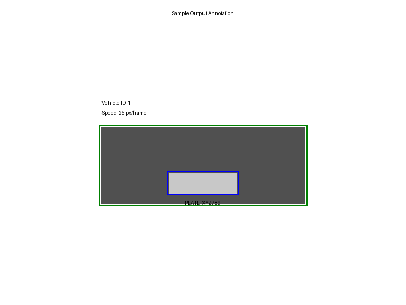

# Vehicle Number Plate Recognition and Speed Monitoring System

## Description
This project is a Python-based system designed to process video footage to detect vehicles, identify their license plates, perform Optical Character Recognition (OCR) on the plate text, track vehicles, and estimate their speed. It utilizes the YOLOv8 model for vehicle detection, custom image processing techniques for license plate localization, and Tesseract OCR for character recognition.

## Features
*   **Vehicle Detection:** Employs the YOLOv8 object detection model to identify vehicles (cars, buses, trucks, motorcycles) in video frames.
*   **License Plate Localization:** Uses image processing techniques (grayscale conversion, blurring, morphological operations, edge detection, and contour analysis) to find potential license plate regions on detected vehicles.
*   **License Plate Character Recognition:** Leverages the Tesseract OCR engine via `pytesseract` to extract alphanumeric text from the localized license plate images.
*   **Vehicle Tracking:** Implements a basic centroid-based tracker to assign unique IDs to vehicles and follow them across frames.
*   **Speed Estimation:** Calculates vehicle speed in "pixels per frame". The system provides clear guidance on how to convert this metric to real-world units (e.g., km/h or mph) using a calibration factor.
*   **Video Processing:** Reads an input video file, processes each frame, and saves an annotated output video showing detections, tracking information, and OCR results.

## Requirements
*   Python 3.7+
*   **Tesseract OCR Engine:** Must be installed system-wide.
*   **Python Libraries:**
    *   Ultralytics YOLOv8 (`ultralytics`)
    *   OpenCV (`opencv-python`)
    *   Pytesseract (`pytesseract`)
    *   NumPy (`numpy`)

    A `requirements.txt` file is provided to install these Python dependencies easily.

## Setup Instructions
1.  **Clone the Repository:**
    ```bash
    git clone <repository_url>
    cd <repository_directory>
    ```

2.  **Install Tesseract OCR Engine:**
    *   **Debian/Ubuntu:**
        ```bash
        sudo apt-get update
        sudo apt-get install -y tesseract-ocr
        ```
    *   **Fedora:**
        ```bash
        sudo dnf install -y tesseract
        ```
    *   **macOS (using Homebrew):**
        ```bash
        brew install tesseract
        ```
    *   **Windows:** Download and run the installer from the [official Tesseract GitHub page](https://github.com/UB-Mannheim/tesseract/wiki). Ensure to add Tesseract to your system's PATH during installation or note the installation path.

3.  **Configure Pytesseract (if needed):**
    If Tesseract is not automatically found in your system's PATH, you may need to specify its location in `main.py` for `pytesseract`. Example (uncomment and edit in the script if necessary):
    ```python
    # import pytesseract
    # pytesseract.pytesseract.tesseract_cmd = r'C:\Program Files\Tesseract-OCR\tesseract.exe' # Example for Windows
    ```

4.  **Install Python Dependencies:**
    It's recommended to use a virtual environment:
    ```bash
    python -m venv venv
    source venv/bin/activate  # On Windows: venv\Scripts\activate
    ```
    Then install the required packages:
    ```bash
    pip install -r requirements.txt
    ```

## Usage
1.  **Input Video:**
    *   Place your input video file named `test_video.mp4` in the root directory of the project.
    *   Alternatively, you can modify the `VIDEO_PATH` variable at the top of the `main.py` script to point to your video file.

2.  **Run the Script:**
    ```bash
    python main.py
    ```

3.  **Configuration:**
    Various parameters such as model paths, detection thresholds, tracking settings, and video paths can be adjusted directly in the configuration section at the top of `main.py`.

## Understanding Speed Calculation
The script estimates vehicle speed in **pixels per frame**. This is a relative measure of speed based on movement in the video.

To convert this to real-world units like kilometers per hour (km/h) or miles per hour (mph), you need:
1.  **`pixels_per_meter` (PPM):** This is a calibration factor that you must determine for your specific camera setup (camera angle, height, lens characteristics, and distance to the area of interest). It represents how many pixels in the video correspond to one real-world meter at the plane where vehicles are moving. This can be found by measuring a known distance in the scene and counting the corresponding pixels in a frame.
2.  **Video FPS (Frames Per Second):** The script attempts to read this from the video file.

The conversion formula is:
```
speed_in_meters_per_second = (speed_in_pixels_per_frame * video_fps) / pixels_per_meter
speed_in_kmh = speed_in_meters_per_second * 3.6
speed_in_mph = speed_in_meters_per_second * 2.23694
```
The script prints guidance on this to the console when run.

## Output
*   **`output_video.mp4`:** The main output. This is a video file containing the original footage annotated with:
    *   Bounding boxes around detected vehicles.
    *   A unique ID for each tracked vehicle.
    *   The estimated speed (in pixels per frame) for each tracked vehicle.
    *   Bounding boxes around detected license plates.
    *   The recognized license plate text (OCR result).
*   **`plate_for_ocr.jpg`:** This image file shows the latest license plate region that was extracted and sent to Tesseract for OCR. It is overwritten each time a new plate is processed.

### Sample Output Preview
Below is a schematic illustration of the typical annotations applied to vehicles in the output video:



## Known Limitations / Future Improvements
*   **License Plate Detection Accuracy:** The current image processing based approach for LP detection can be sensitive to video quality, lighting conditions, plate designs, and vehicle angles. More advanced deep learning models specific to license plate detection could improve this.
*   **OCR Accuracy:** The accuracy of Tesseract OCR is dependent on the quality (resolution, clarity, lighting, orientation) of the extracted license plate image. Preprocessing helps, but results can vary.
*   **Vehicle Tracking Robustness:** The implemented centroid tracker is basic. It can struggle with occlusions, very fast-moving objects, or crowded scenes. More advanced tracking algorithms like SORT, DeepSORT, or Kalman filters could provide more robust and persistent tracking.
*   **Speed Estimation Calibration:** The current speed is relative (pixels/frame). Accurate real-world speed requires careful manual calibration (`pixels_per_meter` factor) for each specific camera deployment.
*   **No Graphical User Interface (GUI):** The script is command-line based.
*   **Error Handling:** While some error handling is present, it could be made more comprehensive for production use.
*   **Performance:** Processing high-resolution video in real-time can be computationally intensive. Optimizations or more powerful hardware might be needed for certain applications.

## Running Tests
The project includes a basic set of unit tests for the `VehicleTracker` class. To run these tests:

1.  Ensure you have installed the development dependencies (if any, though for these basic tests, the main requirements should suffice).
2.  Navigate to the project root directory in your terminal.
3.  Run the unittest module, discovering tests in the `tests` directory:
    ```bash
    python -m unittest discover -s tests
    ```
    Or, to run a specific test file:
    ```bash
    python -m unittest tests/test_tracker.py
    ```
